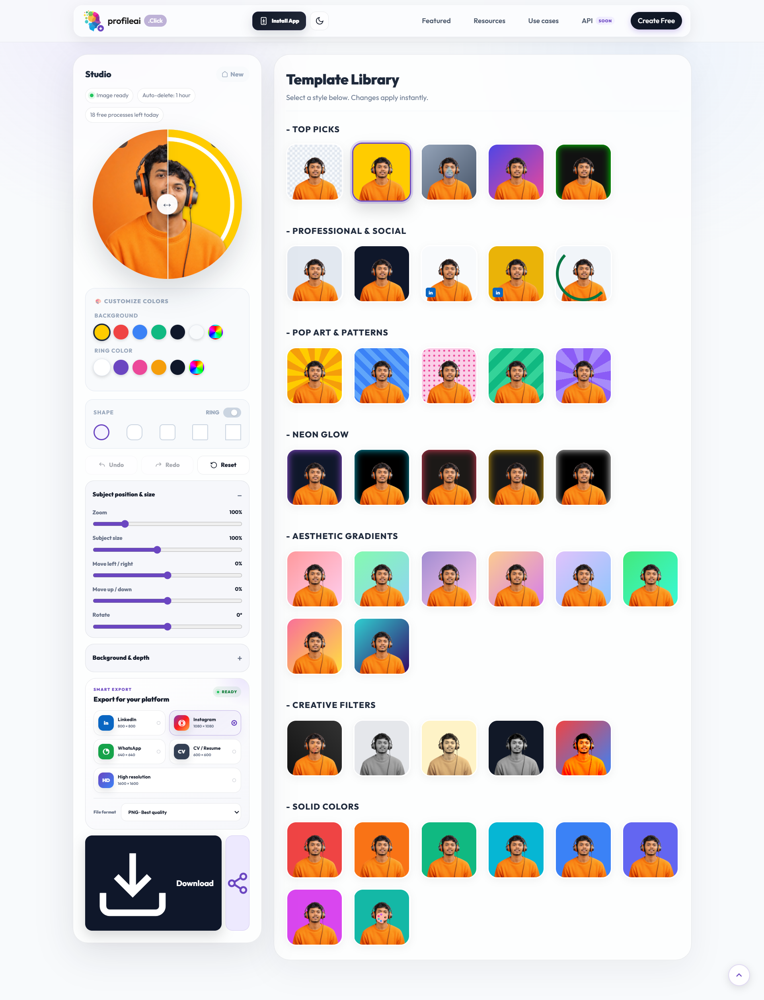

<div align="center">


# ProfileAI

### AI Profile Picture Maker & Background Remover

Create polished, professional, and platform-ready profile pictures directly in your browser.

<br>

[](https://profileai.click)
[](https://profileai.click)
[](https://whitecoder.lk)
[](#request-source-code-access)

<br>


</div>

---

## About ProfileAI

**ProfileAI** is a modern, responsive web application that helps users create professional profile pictures using AI-powered background removal and a browser-based editing studio.

Users can upload a portrait, crop it, automatically remove the background, select a professional design, customize colors and shapes, and download a high-quality profile picture without creating an account.

The platform is optimized for social media, professional profiles, CVs, portfolios, and business use.

### Live Application

**Website:** https://profileai.click

---

## Application Preview

<div align="center">

### Desktop Experience


<br><br>

### Mobile App Experience



</div>

---

## Main Features

### AI Image Processing

* AI-powered portrait background removal
* JPG, JPEG, PNG, and WebP image support
* Secure server-side image validation
* Automatic image cropping before processing
* High-quality transparent subject output
* Configurable daily processing limits
* Automatic cleanup of temporary user images

### Profile Picture Studio

* More than **40 professionally designed templates**
* Transparent background option
* Solid-color backgrounds
* Custom background color picker
* Aesthetic gradient backgrounds
* Neon glow designs
* Pop-art and pattern styles
* Professional LinkedIn designs
* LinkedIn-style badge templates
* Open-to-Work style templates
* Blur background effect
* Creative photo filters
* Custom ring and border colors
* Optional profile-picture ring
* Circle, squircle, rounded, slightly rounded, and square shapes
* Instant real-time template preview
* HD profile picture download

### Platform-Ready Experiences

ProfileAI includes dedicated experiences for:

* LinkedIn profile pictures
* Instagram profile pictures
* WhatsApp profile pictures
* CV and résumé profile pictures
* Personal websites and portfolios
* Business and professional accounts

### Progressive Web App

* Installable on supported desktop and mobile browsers
* Standalone app-like display mode
* Mobile bottom navigation
* Safe-area support for modern mobile devices
* Offline fallback page
* Service-worker caching
* App shortcuts
* Android maskable icons
* Apple touch icons
* Windows tile support
* Responsive desktop and mobile layouts

### Public Website and SEO

* Clean public URLs
* Search-engine optimized metadata
* Canonical URLs
* Open Graph social sharing images
* Twitter card metadata
* Schema.org structured data
* XML sitemap
* Robots.txt configuration
* Dedicated Privacy Policy page
* Dedicated Terms and Conditions page
* Custom 404 page
* SEO landing pages for major platforms

### Developer API Preview

The project includes a preview page for the upcoming ProfileAI Developer API.

Planned packages include:

* Free
* Best
* Pro

> The public developer API, pricing, request limits, batch processing, and webhooks are currently marked as **Coming Soon**.

---

## How ProfileAI Works

```text
Upload Photo
     ↓
Crop Portrait
     ↓
AI Background Removal
     ↓
Choose a Template
     ↓
Customize Colors, Ring and Shape
     ↓
Preview the Result
     ↓
Download the HD Profile Picture
```

---

## Technology Stack

| Area               | Technology                                               |
| ------------------ | -------------------------------------------------------- |
| Frontend           | HTML5, CSS3, JavaScript                                  |
| UI Framework       | Tailwind CSS and custom responsive CSS                   |
| Image Cropping     | Cropper.js                                               |
| Image Rendering    | HTML Canvas API                                          |
| Backend            | PHP                                                      |
| Background Removal | remove.bg API integration                                |
| Notifications      | Telegram Bot integration                                 |
| PWA                | Web App Manifest and Service Worker                      |
| SEO                | Open Graph, Twitter Cards, Schema.org, Sitemap           |
| Server             | Apache with `.htaccess` clean URL rules                  |
| Storage            | Temporary local file storage and JSON rate-limit records |

---

## Project Structure

```text
profileai.click/
├── assets/
│   ├── css/
│   │   ├── api.css
│   │   ├── legal.css
│   │   ├── public-pages.css
│   │   └── studio-pages.css
│   └── js/
│       ├── api.js
│       ├── legal.js
│       ├── public-pages.js
│       └── studio-pages.js
│
├── config/
│   ├── .htaccess
│   └── private.php
│
├── icons/
│   ├── app icons
│   ├── favicon files
│   ├── maskable icons
│   └── Apple touch icon
│
├── images/
│   ├── process illustrations
│   ├── feature images
│   └── tutorial images
│
├── includes/
│   ├── seo-landing.php
│   ├── site-assets.php
│   └── studio-shell.php
│
├── screenshots/
│   ├── profileai-desktop.png
│   └── profileai-mobile.png
│
├── storage/
│   └── rate_limits/
│
├── uploads/
│   └── profiles/
│
├── api.php
├── cleanup.php
├── cv-profile-picture.php
├── index.php
├── instagram-profile-picture.php
├── linkedin-profile-picture.php
├── offline.html
├── privacy.php
├── process.php
├── service-worker.js
├── telegram.php
├── terms.php
├── whatsapp-profile-picture.php
├── manifest.webmanifest
├── sitemap.xml
├── robots.txt
└── .htaccess
```

---

## Public Routes

```text
/
├── /linkedin-profile-picture
├── /instagram-profile-picture
├── /whatsapp-profile-picture
├── /cv-profile-picture
├── /api
├── /privacy
└── /terms
```

Internal processing routes:

```text
/api/process
/api/telegram
```

---

## Server Requirements

Authorized deployments require:

* PHP 8.0 or newer
* Apache web server
* Apache `mod_rewrite`
* PHP cURL extension
* PHP Fileinfo extension
* PHP image-information support
* HTTPS certificate
* Writable `uploads/profiles` directory
* Writable `storage/rate_limits` directory
* A valid remove.bg API key
* Optional Telegram Bot credentials

---

## Authorized Installation

The complete source code is not publicly distributed. These setup instructions are intended only for approved users who have received the protected project archive and password.

### 1. Extract the Project

Extract the protected ZIP archive using the password supplied privately by the developer.

### 2. Upload the Files

Upload the contents of the `profileai.click` directory to the website document root.

Common locations include:

```text
public_html/
htdocs/
www/
```

### 3. Configure Private Settings

Open:

```text
config/private.php
```

Configure the following values:

```php
remove_bg_api_keys
telegram_bot_token
telegram_chat_id
daily_api_limit
max_upload_bytes
saved_file_lifetime_seconds
```

Never expose this file publicly or commit real credentials to GitHub.

### 4. Configure Directory Permissions

Ensure the web server can write to:

```text
uploads/profiles/
storage/rate_limits/
```

### 5. Enable Clean URLs

Confirm that Apache `.htaccess` files and `mod_rewrite` are enabled.

### 6. Configure Cleanup

Run `cleanup.php` through a hosting cron job to remove expired temporary files according to the configured file lifetime.

### 7. Clear Old PWA Cache

After updating a deployed version:

1. Clear the hosting or CDN cache.
2. Unregister the previous service worker when necessary.
3. Clear the website's cached data.
4. Reload the application.

---

## Security and Privacy

ProfileAI includes several safeguards for uploaded user content:

* File-type validation
* MIME-type validation
* Minimum image-dimension validation
* Configurable maximum upload size
* Per-IP daily usage controls
* Temporary image storage
* Automatic file cleanup
* Protected configuration directory
* Protected storage directory
* Protected upload execution rules
* Private API credentials stored outside public code
* Privacy and terms pages

Uploaded photos should only be retained for the configured temporary processing period.

---

## Public Repository Notice

This GitHub repository is used as a **project showcase and portfolio reference**.

The complete application source is provided only as a password-protected archive. The password is not published in the repository.

Public access to this repository does not grant permission to:

* Copy the protected source code
* Redistribute the application
* Resell the project
* Remove the original developer credits
* Publish modified copies as original work
* Use the project commercially without written permission
* Share the protected archive or password with another person

---

## Request Source Code Access

For authorized source-code access, project customization, commercial development, academic demonstrations, or deployment support, contact the developer directly.

<div align="center">

[](mailto:oshanda@whitecoder.lk)

[](https://wa.me/94788778100)

</div>

When requesting access, include:

```text
Name:
Purpose:
Project or organization:
Required service:
Source code / customization / deployment:
```

The archive password will only be shared privately with approved users.

---

## Repository Files

A recommended public showcase repository can contain:

```text
ProfileAI/
├── README.md
├── logo.png
├── og-image.jpg
├── screenshots/
│   ├── profileai-desktop.png
│   └── profileai-mobile.png
└── ProfileAI-Source-Code-Protected.zip
```

Do not include private credentials, API keys, production logs, user uploads, temporary files, or the archive password.

---

## Status

| Component                     | Status      |
| ----------------------------- | ----------- |
| Public Profile Picture Studio | Available   |
| AI Background Removal         | Available   |
| Platform Templates            | Available   |
| HD Export                     | Available   |
| Progressive Web App           | Available   |
| Privacy and Terms Pages       | Available   |
| Developer API                 | Coming Soon |
| API Pricing Plans             | Coming Soon |

---

## Developer

<div align="center">

### Oshanda Geethanjana

**Founder & Full Stack Developer at WhiteCoder**

[](https://oshanda.com)
[](https://whitecoder.lk)
[](https://github.com/oshandapc)
[](https://instagram.com/whitecoder._)

</div>

---

## Copyright and License

```text
Copyright © 2026 WhiteCoder.
All Rights Reserved.
```

This project is proprietary software. No open-source license is granted.

The source code, user interface, branding, design, documentation, images, and related project materials may not be copied, modified, distributed, sublicensed, or sold without prior written permission from the copyright owner.

---

<div align="center">


### Create a profile picture that represents you.

[Open ProfileAI](https://profileai.click) · [Visit WhiteCoder](https://whitecoder.lk) · [Contact Developer](https://wa.me/94788778100)

<br>

**Designed and developed by WhiteCoder**

© 2026 WhiteCoder. All Rights Reserved.

</div>
